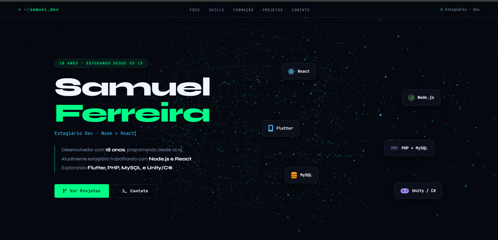

# 🚀 Portfólio — Samuel Ferreira

🔗 Acesse o site: https://samuelferreiradev.netlify.app/

---

## 🖥️ Preview

---

## 📌 Sobre o projeto

Este é meu portfólio pessoal como desenvolvedor web, criado para apresentar minha trajetória, habilidades técnicas e projetos desenvolvidos ao longo da minha evolução na área de tecnologia.

O objetivo do projeto é centralizar minha identidade profissional e demonstrar, na prática, minha capacidade de construir interfaces modernas, responsivas e com foco em experiência do usuário.

---

## 🛠️ Tecnologias utilizadas

- HTML5  
- CSS3  
- JavaScript (ES6+)  
- Three.js  
- Font Awesome  
- Google Fonts  

---

## 🎯 Objetivo do projeto

- Construir uma vitrine profissional de apresentação pessoal
- Consolidar projetos em um único ambiente centralizado
- Demonstrar habilidades práticas em desenvolvimento front-end
- Aplicar conceitos de UI moderna, responsividade e animações web

---

## 📂 Estrutura do site

O portfólio está organizado em seções bem definidas:

- **Hero** → apresentação inicial e stack principal  
- **Foco atual** → tecnologias em uso e aprendizado contínuo  
- **Skills** → habilidades técnicas com níveis de domínio  
- **Formação** → trajetória acadêmica e cursos  
- **Projetos** → trabalhos desenvolvidos ao longo da jornada  
- **Contato** → canais de comunicação  

---

## ⚙️ Destaques técnicos

- Interface moderna com animações fluidas
- Efeitos visuais utilizando Three.js
- Cursor customizado e interações dinâmicas
- Layout responsivo para diferentes dispositivos
- Estrutura semântica e organizada em seções
- Experiência visual focada em imersão e identidade dev

---

## 📈 Status do projeto

Projeto em constante evolução, com melhorias contínuas de performance, design e novas seções sendo adicionadas conforme avanço técnico.

---

## 📫 Contato

- Email: **samuelferreiradev08@gmail.com**  
- GitHub: https://github.com/samuel208-max  
- Portfólio: https://samuelferreiradev.netlify.app  

---

## 🧠 Observação

Este projeto representa minha identidade como desenvolvedor e funciona como minha principal vitrine profissional online, refletindo minha evolução contínua na área de tecnologia.
